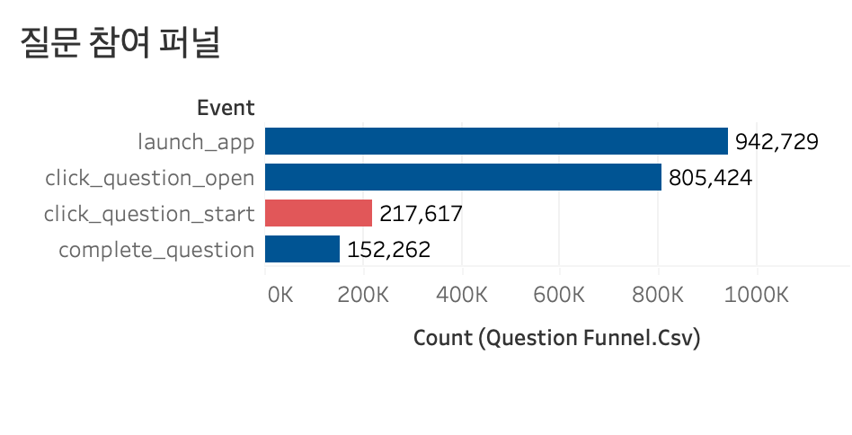
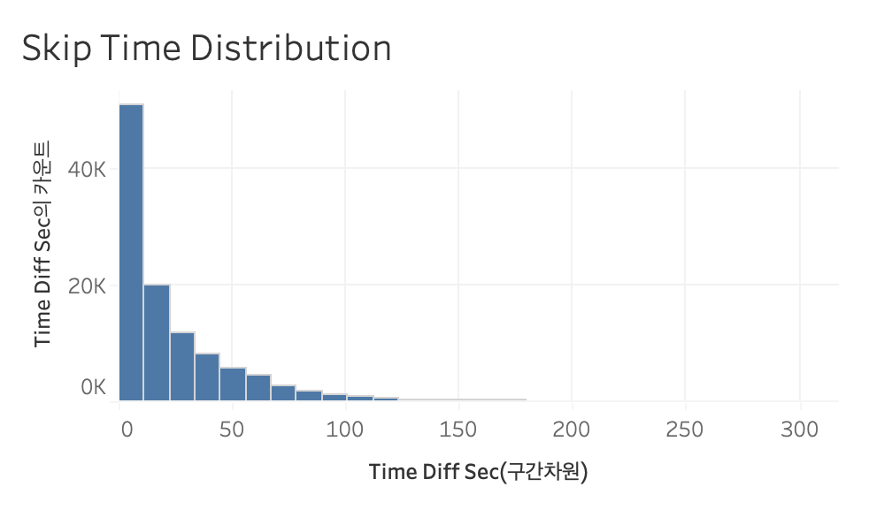
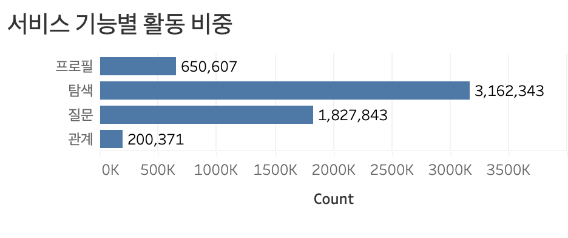

# event-log-funnel-analysis

## 프로젝트 개요

질문 기반 SNS 서비스의 이벤트 로그 데이터를 분석하여  
유저 이탈 구조와 질문 UX 흐름 문제를 분석한 프로젝트입니다.

---

## 프로젝트 목표

- 질문 기능 사용 과정에서의 이탈 구조 파악
- 질문 완료율 저하 원인 분석
- skip 행동 패턴 분석
- 질문 이후 행동 흐름 분석
- UX 및 콘텐츠 구조 개선 방향 도출

---

## 주요 분석

### 1. Question Funnel Analysis

- launch_app
- question_open
- question_start
- complete_question

질문 진입 대비 완료율 감소 구조 분석

### 2. Skip Time Distribution

- 질문 시작 직후 빠른 skip 발생 여부 분석
- 20초 이내 skip 집중 패턴 확인

### 3. Session Depth Analysis
- 질문 세션 vs 일반 세션 활동성 비교
- 질문 기능 자체 수요 존재 여부 확인

### 4. Event Category Distribution

- 탐색 / 질문 / 프로필 / 관계 기능 사용 비중 분석

### 5. UX Flow Analysis
- 질문 이후 대기 구조
- 포인트 제한 구조
- 힌트 구매 흐름
- 관계 기능 연결 구조 분석

---

## 주요 인사이트

유저는 질문 자체를 회피한 것이 아니라,

질문 수행 과정에서 빠르게 이탈하고 있었다.

특히:
- 반복적인 skip 구조
- 빠른 이탈 패턴
- 제한형 UX 흐름
- 관계 기능 연결 부족

등이 주요 문제로 나타났다.

---

## 사용 기술

- Python
- Pandas
- Matplotlib
- Tableau
- Google Colab
- GitHub

---

## 파일 구성

| 파일명 | 설명 |
|---|---|
| question_funnel.csv | 질문 퍼널 분석 |
| skip_time_distribution.csv | skip 시간 분포 |
| session_depth.csv | 세션 깊이 분석 |
| next_event_after_complete.csv | 완료 이후 행동 분석 |
| previous_event_before_skip.csv | skip 이전 행동 분석 |
| event_category_distribution.csv | 기능별 이벤트 비중 분석 |

본 프로젝트는 사용자 이벤트 로그 기반 행동 분석을 통해
질문 UX 흐름과 이탈 구조를 분석한 데이터 분석 프로젝트입니다.
